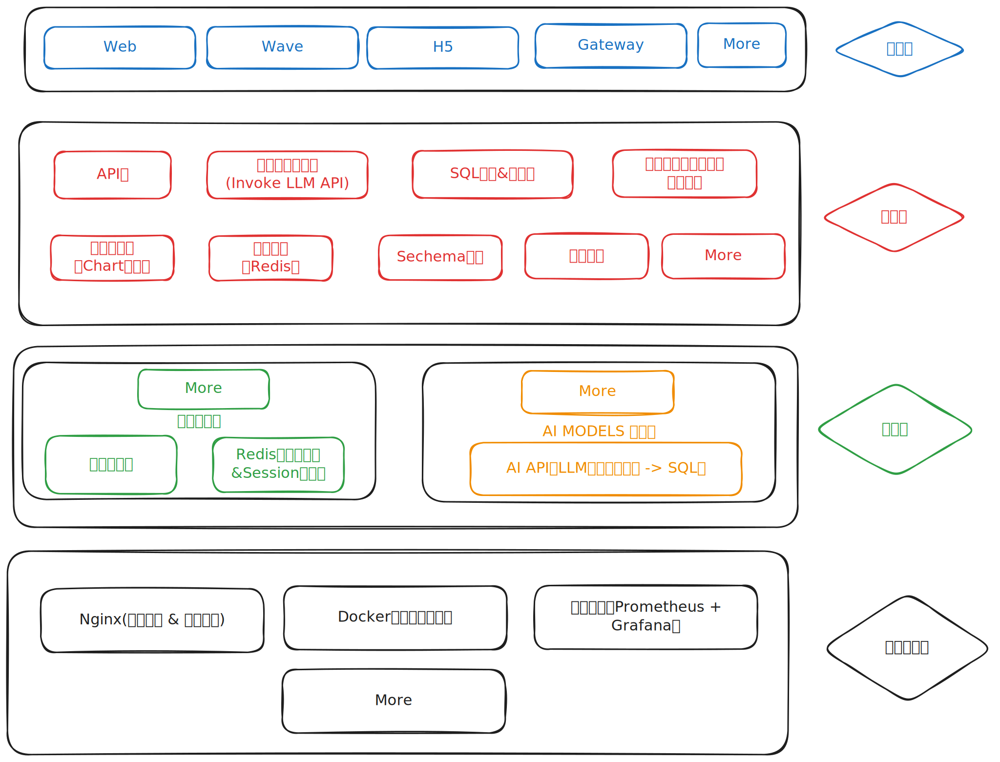
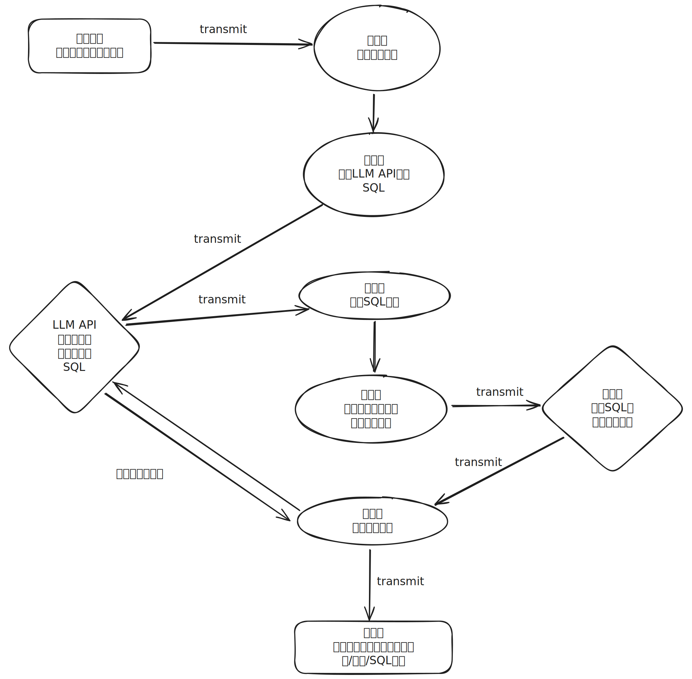

# DeepSeek2Web (d2t)

DeepSeek2Web is a web application that provides a user interface for interacting with the DeepSeek AI model, with a modern Next.js frontend and a Go-based backend.

**🔗 Live Preview:** [http://3.27.63.61/](http://3.27.63.61/) - Check out the live demo!

## Project Overview

This project is a full-stack web application that consists of:

- A **Next.js frontend** with React 19 and TailwindCSS
- A **Go backend service** using Gin web framework
- A **PostgreSQL database** for data persistence
- **Nginx** as a reverse proxy for the web services

## Architecture

```
├── be-server/           # Go backend service
│   ├── internal/        # Internal application code
│   ├── core/            # Core domain logic
│   ├── utils/           # Utility functions
│   └── ...
├── d2t-ui/              # Next.js frontend application
│   ├── src/             # Frontend source code
│   ├── public/          # Static assets
│   └── ...
├── nginx/               # Nginx configuration files
│   ├── conf.d/          # Site-specific configurations
│   └── nginx.conf       # Main Nginx configuration
├── pg-init-scripts/     # PostgreSQL initialization scripts
├── deepseek-server/     # DeepSeek AI model server (placeholder)
└── docker-compose.yml   # Docker Compose configuration for the entire stack
```


## Components

### Go Backend Service (be-server)

A RESTful API service built with Go and Gin framework that handles business logic and database operations.

[See be-server README](./be-server/README.md) for detailed information.

### Next.js Frontend (d2t-ui)

A modern web interface built with Next.js, React 19, and TailwindCSS.

Key features:
- React 19 for UI components
- Next.js for server-side rendering and routing
- TailwindCSS for styling
- TypeScript for type safety

### PostgreSQL Database

A PostgreSQL database for storing application data.

### Nginx

Nginx serves as a reverse proxy, routing requests to the appropriate services and handling SSL termination.

## Getting Started

### Prerequisites

- Docker and Docker Compose
- Git

### Local Development

#### Clone the Repository

```bash
git clone https://github.com/DorianTian/d2t.git
cd d2t
```

#### Run with Docker Compose

The easiest way to run the entire stack is with Docker Compose:

```bash
docker-compose up -d
```

This will start all the services defined in the `docker-compose.yml` file:
- PostgreSQL database
- Go backend service
- Next.js frontend
- Nginx reverse proxy

The application will be available at http://localhost (port 80).

### Manual Development Setup

If you prefer to run components individually for development:

#### 1. Start PostgreSQL

```bash
docker-compose up -d postgres
```

#### 2. Run Go Backend

```bash
cd be-server
go mod download
go run main.go
```

The backend will be available at http://localhost:8080.

#### 3. Run Next.js Frontend

```bash
cd d2t-ui
npm install
npm run dev
```

The frontend development server will be available at http://localhost:3000.

## Deployment

### Docker Deployment

For production deployment, use Docker Compose:

```bash
docker-compose -f docker-compose.yml up -d
```

### AWS Deployment

See [AWS_DEPLOYMENT.md](./AWS_DEPLOYMENT.md) for AWS deployment instructions.

## Configuration

Each component has its own configuration files:

- Backend: `.env` file in `be-server/`
- Frontend: `.env.production` and `.env.local` in `d2t-ui/`
- Database: Environment variables in `docker-compose.yml`
- Nginx: Configuration files in `nginx/` directory

## License

MIT License
